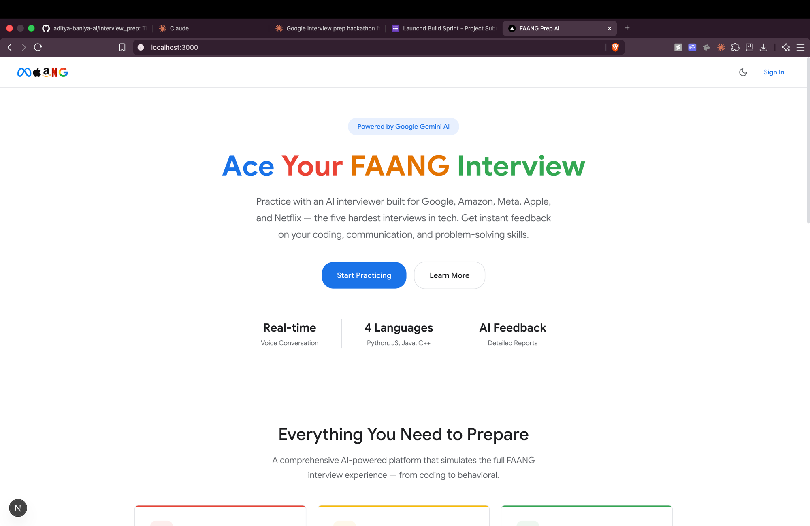
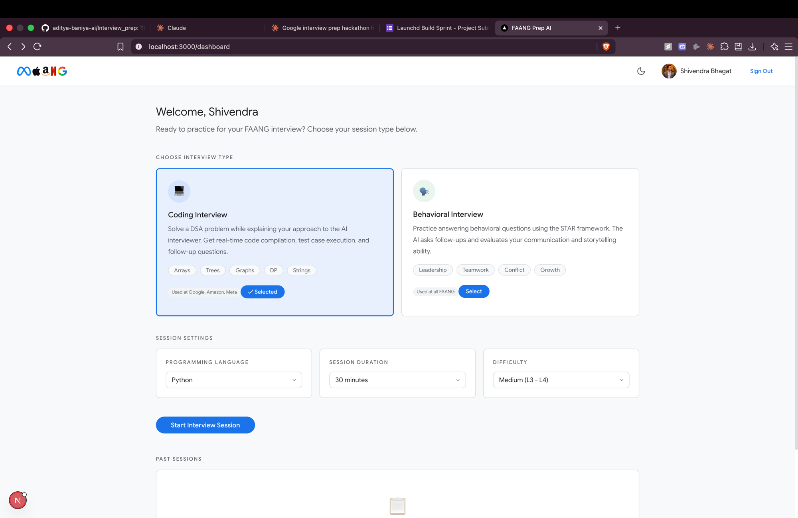

# FAANG Prep AI

> A real-time AI mock interview platform for Google, Amazon, Meta, Apple, and Netflix — built with Gemini Live API, Next.js, and FastAPI.

---

## The Problem

Preparing for FAANG interviews is hard — not because the material is inaccessible, but because **realistic practice is**. LeetCode tells you if your code is correct. YouTube teaches you STAR frameworks. But nothing puts you in the actual discomfort of speaking your solution out loud under time pressure, to a human who asks follow-up questions, while your code is being watched.

Mock interviews with real engineers are rare, expensive, and hard to schedule. AI chatbots are better than nothing, but they're asynchronous — you type, you wait, you read. That's not what a real interview feels like.

**FAANG Prep AI solves this by simulating the full interview experience end-to-end**: a voice-first AI interviewer that listens, responds, watches your code in real time, and delivers a structured hire/no-hire decision when you're done.

---

## Screenshots

### Landing Page


### Dashboard — Choose Your Interview


---

## What It Does

### Two Interview Tracks

**Coding Interview (DSA)**
- The AI presents a real DSA problem (Arrays, Trees, Graphs, DP, Strings) calibrated to Easy / Medium / Hard (L2–L5+)
- You speak your approach out loud while writing code in a Monaco editor
- Your code is silently synced to the AI in real time — it can see exactly what you're building and gives targeted hints accordingly
- A Judge0 sandbox compiles and runs your code against test cases in real time
- Access to a **comprehensive problem bank of 50+ curated FAANG questions**, filtered seamlessly on your dashboard.

**Behavioral Interview (STAR)**
- The AI asks behavioral questions on Leadership, Teamwork, Conflict Resolution, and Growth
- It listens to your full answer and probes with natural follow-up questions
- Evaluates STAR structure, communication clarity, and storytelling ability

### Real-Time Voice — Not a Chatbot
The interviewer is fully voice-driven. You speak; it listens and responds with sub-second latency using Google's **Gemini Live API** over a persistent WebSocket. There is no typing, no submit button, no waiting for a page to load. It feels like a phone call.

### Animated AI Interviewer — "Sarah"
The interview UI simulates a video call with a photorealistic AI interviewer. Her mouth animates in sync with her speech — without any third-party avatar API. The system alternates between a closed-mouth and open-mouth image on a 150ms interval whenever audio is streaming, creating a convincing lip-sync effect at zero added cost or latency.

### Responsive & Accessible Everywhere
The entire platform is fully responsive and optimized for mobile devices, allowing candidates to practice anywhere. We also offer a **Guest Login** flow for frictionless access alongside standard Google/Firebase authentication.

### Feedback Report
When the interview ends, Gemini 2.5 Flash — acting as a Senior Engineer — evaluates your complete transcript and final code submission against a structured rubric:

- **Communication** — Clarity, structure, articulation
- **Problem Solving** — Approach, edge case handling, hint usage
- **Code Quality** — Correctness, time/space complexity, readability
- **Engagement** — Confidence, eye contact, composure
- **Final Decision** — Hire / Lean Hire / Lean No Hire / No Hire

---

## Architecture

```
Browser (Next.js)
    │
    ├── 1. Requests ephemeral token  ──►  FastAPI Backend (Cloud Run)
    │                                         │
    │   ◄── Short-lived token ────────────────┘
    │
    ├── 2. Opens direct WebSocket  ──►  Gemini Live API (wss://)
    │         │                               │
    │   PCM audio (16kHz, base64)    ◄── Audio chunks + text
    │
    ├── 3. Code sync (in real time) ──►  WebSocket clientContent
    │
    └── 4. End of interview POST  ──►  FastAPI /generate-feedback
                                           │
                                      Gemini 2.5 Flash
                                           │
                                    Structured JSON report
```

### Why Ephemeral Tokens?
Streaming microphone audio through a backend server would introduce 200–400ms of unnecessary latency on every audio chunk. Instead, the backend generates a **short-lived authentication token** (valid for one session), hands it to the browser, and the browser opens a direct WebSocket to Google's infrastructure. The API key never touches the client. Low latency, full security.

### Multi-Agent Backend (Google ADK)
The backend uses **Google's Agent Development Kit** to orchestrate a hierarchy of specialized agents:

| Agent | Responsibility |
|---|---|
| `Orchestrator` | Routes to the correct agent based on interview phase |
| `CodingInterviewer` | DSA problem presentation, hint management |
| `BehavioralInterviewer` | STAR question flow and follow-up logic |
| `CodeEvaluator` | Real-time code analysis and complexity feedback |
| `FeedbackGenerator` | Post-interview scoring and hire decision |

---

## Tech Stack

| Layer | Technology |
|---|---|
| **Frontend** | Next.js 16 (App Router), React, TypeScript, CSS Modules |
| **Code Editor** | Monaco Editor (same engine as VS Code) |
| **Audio** | Web Audio API — PCM capture, base64 streaming, Float32 playback |
| **Backend** | Python 3.12, FastAPI, Uvicorn |
| **AI — Voice** | Gemini Live API (`gemini-2.0-flash-live-preview`) via WebSocket |
| **AI — Feedback** | Gemini 2.5 Flash (structured JSON evaluation) |
| **Agent Framework** | Google ADK (Agent Development Kit) |
| **Code Execution** | Judge0 (multi-language sandbox) |
| **Database & Auth** | Firebase Firestore (Problem Bank) + Firebase Authentication |
| **Deployment** | Vercel (Frontend) & Google Cloud Run (Backend) |
| **Theming** | CSS custom properties, light/dark toggle, flash-free SSR |

---

## Local Setup

### Prerequisites
- Node.js 18+
- Python 3.12+
- A Google Gemini API key
- A Firebase project (for Auth and Firestore)

### 1. Clone the repo
```bash
git clone https://github.com/aditya-baniya-ai/Interview_prep.git
cd Interview_prep/google-interview-prep
```

### 2. Frontend Setup
```bash
npm install
```

Create `.env.local`:
```env
NEXT_PUBLIC_FIREBASE_API_KEY=...
NEXT_PUBLIC_FIREBASE_AUTH_DOMAIN=...
NEXT_PUBLIC_FIREBASE_PROJECT_ID=...
NEXT_PUBLIC_FIREBASE_STORAGE_BUCKET=...
NEXT_PUBLIC_FIREBASE_MESSAGING_SENDER_ID=...
NEXT_PUBLIC_FIREBASE_APP_ID=...
NEXT_PUBLIC_BACKEND_URL=http://localhost:8000
```

Start the Next.js development server:
```bash
npm run dev
```

### 3. Backend Setup
```bash
cd backend
python3.12 -m venv venv
source venv/bin/activate
pip install -r requirements.txt
```

Create `backend/.env`:
```env
GEMINI_API_KEY=your_key_here
```

Start the FastAPI backend:
```bash
uvicorn main:app --reload --port 8000
```

Frontend → `http://localhost:3000` · Backend → `http://localhost:8000`

---

## The Latency Problem — and How We Solved It

Real-time voice AI sounds straightforward until you build it. Every millisecond of delay breaks the illusion — a 500ms lag between when you finish speaking and when the AI responds feels like talking to someone on a bad satellite call. It kills the interview simulation entirely.

We hit three distinct latency problems and solved each one differently.

**Problem 1: Audio routing through the backend added 200–400ms per chunk**

Our first instinct was to stream microphone audio from the browser → our FastAPI server → Gemini. Every audio chunk made two network hops instead of one. At 16kHz PCM, that's hundreds of small payloads per second, each paying the round-trip tax. The conversation felt sluggish and unnatural.

*Solution: Ephemeral token architecture.* The backend's only job at session start is to authenticate with Google and return a short-lived token. The browser then opens a **direct WebSocket to Gemini's infrastructure** — zero intermediary. Audio travels one hop. The API key never leaves the server. Latency dropped immediately.

**Problem 2: The AI interrupted too eagerly — or waited too long**

Out of the box, Gemini's Voice Activity Detection (VAD) would trigger the AI response the moment audio stopped — even mid-sentence when you paused to think. On the other extreme, conservative settings made the AI feel unresponsive. In an interview context, premature interruptions are particularly disruptive: candidates lose their train of thought.

*Solution: Tuned VAD with a 3-second end-of-speech threshold.* We configured the session to wait 3 seconds of silence before treating speech as complete. This matches how real interviewers behave — they give you space to think. The result is a conversation rhythm that feels natural rather than pressured.

**Problem 3: Audio playback had crackling and buffer underruns**

Gemini streams audio back as base64-encoded Int16 PCM chunks of inconsistent sizes. Playing them directly caused audible crackling because the `AudioContext` was starved between chunks. We needed a buffer.

*Solution: Chunk accumulation with Float32 conversion.* Incoming base64 chunks are decoded to Int16, converted to Float32 (dividing by 32768), and queued into an `AudioContext` buffer that plays continuously rather than chunk-by-chunk. The result is smooth, uninterrupted playback regardless of network jitter.

The combined effect: end-to-end voice latency under 800ms in typical conditions — responsive enough to feel like a real conversation.

---

## Multimodal AI — More Than Just Voice

Most "AI interviewers" are language models with a chat interface. FAANG Prep AI processes **four distinct input modalities simultaneously** throughout the session.

**1. Voice (bidirectional audio)**
The primary channel. The candidate speaks; Gemini processes raw audio — not a transcript — which means it captures hesitation, filler words, pacing, and confidence in ways that text transcription discards. The AI responds in natural speech, not synthesized from text-to-speech after the fact.

**2. Live Code (silent text injection)**
In real time, the current state of the Monaco editor is pushed into the AI's context window as a silent `clientContent` message. The AI doesn't wait to be told about your code — it just knows. This enables organic, code-aware questions: *"You're using O(n²) here — is there a way to bring that down?"* without the candidate having to explicitly submit or share anything.

**3. Webcam (video)**
The candidate's webcam feed is active throughout the session. The system captures engagement signals — eye contact, posture, composure — that feed into the post-interview feedback score under the **Engagement** dimension. This is the modality that no text-based prep tool can replicate.

**4. Structured Evaluation (analytical reasoning)**
At session end, Gemini 2.5 Flash receives the complete transcript, final code, webcam engagement signals, and hint count as a unified context. It doesn't just summarize — it reasons across all four modalities to produce a hire/no-hire decision grounded in the same rubric real interviewers use.

This is what makes the system genuinely multimodal: not four separate pipelines bolted together, but a single session context that grows richer across voice, code, and video simultaneously.

---

## Key Engineering Decisions

**Direct WebSocket to Gemini (not proxied)**
Routing audio through the backend would add 200–400ms per chunk. The ephemeral token pattern eliminates this without compromising key security.

**Lip-sync without an avatar API**
Services like HeyGen add ~1–2s of latency and significant cost per session. The alternating image approach delivers a visually convincing result at zero added latency or cost.

**Live code sync as silent context**
Rather than asking the candidate to explicitly "submit" their code, a background interval pushes the current editor state into the AI's context window in real time. The interviewer naturally incorporates this — asking "I see you're using a hash map here, can you walk me through why?" — without any explicit handoff.

**CSS-only dark mode with no flash**
An inline `<script>` in `<head>` reads `localStorage` synchronously before React hydrates, setting `data-theme` on `<html>` before the first paint. Zero flash of wrong theme.

---

## Built By

Shivendra Bhagat · Saurav Rijal · Aaditya Baniya

---

*"The best way to prepare for a FAANG interview is to do one — as many times as you need."*
