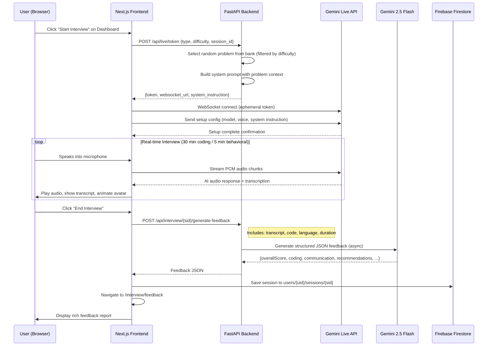
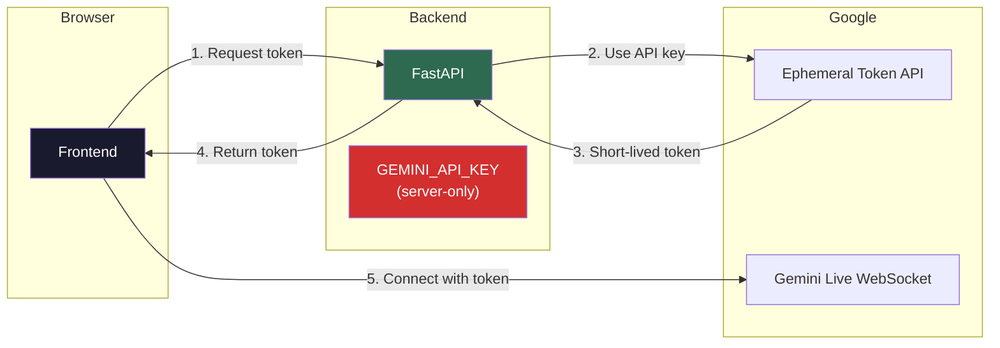

# Google Interview Prep AI — Full Architecture & Features Documentation

## Overview

A full-stack AI-powered mock interview platform that simulates a realistic Google interview experience. Users authenticate with Google, configure a coding or behavioral interview session, and engage in real-time voice conversation with an AI interviewer ("Sarah") powered by the Gemini Live API. After the session, the system generates a detailed performance report with scoring, recommendations, and side-by-side code comparison.

---

## System Architecture

```mermaid
graph TB
    subgraph Browser["Browser (Next.js Client)"]
        LP[Landing Page<br/>/]
        LG[Login Page<br/>/login]
        DB[Dashboard<br/>/dashboard]
        IV[Interview Room<br/>/interview]
        FB[Feedback Report<br/>/interview/feedback]
    end

    subgraph Firebase["Firebase (Google Cloud)"]
        FA[Firebase Auth<br/>Google OAuth]
        FS[Firestore Database<br/>users/{uid}/sessions/{sid}]
    end

    subgraph Backend["FastAPI Backend (Python)"]
        API[REST API<br/>:8000]
        WS[WebSocket Manager]
        GL[Gemini Live Token<br/>/api/live/token]
        FBG[Feedback Generator<br/>/api/interview/{sid}/generate-feedback]
        PB[Problem Bank<br/>18 LeetCode Problems]
    end

    subgraph Google["Google AI"]
        GLive[Gemini Live API<br/>Real-time Voice WebSocket]
        GFlash[Gemini 2.5 Flash<br/>Feedback Generation]
    end

    LP --> LG
    LG -->|Google Sign-In| FA
    FA -->|Auth State| DB
    DB -->|Start Session| IV
    IV -->|Request Token| GL
    GL -->|Ephemeral Token| IV
    IV <-->|Direct WebSocket<br/>Audio Streaming| GLive
    IV -->|End Interview| FBG
    FBG -->|Transcript + Code| GFlash
    GFlash -->|JSON Feedback| FBG
    FBG -->|Feedback JSON| IV
    IV -->|Save Session| FS
    IV --> FB
    FB -->|Load Historical| FS
    DB -->|Load Past Sessions| FS

    style Browser fill:#1a1a2e,color:#fff
    style Firebase fill:#ff9800,color:#000
    style Backend fill:#2d6a4f,color:#fff
    style Google fill:#4285f4,color:#fff
```

---

## Data Flow: End-to-End Interview Session



---

## File Structure

```
google-interview-prep/
├── .env.local                          # Frontend env vars (Firebase, backend URL)
├── src/
│   ├── app/
│   │   ├── page.tsx                    # Landing page (hero, features, CTA)
│   │   ├── page.module.css             # Landing page styles
│   │   ├── globals.css                 # Global design system (tokens, utilities)
│   │   ├── layout.tsx                  # Root layout with AuthProvider
│   │   ├── login/
│   │   │   ├── page.tsx                # Google OAuth login page
│   │   │   └── login.module.css
│   │   ├── dashboard/
│   │   │   ├── page.tsx                # Session config + history from Firestore
│   │   │   └── dashboard.module.css
│   │   ├── interview/
│   │   │   ├── page.tsx                # Live interview room (voice, code editor, avatar)
│   │   │   ├── interview.module.css
│   │   │   └── feedback/
│   │   │       ├── page.tsx            # Post-interview feedback report
│   │   │       └── feedback.module.css
│   │   └── lib/
│   │       ├── firebase.ts             # Firebase init (Auth + Firestore)
│   │       ├── auth.tsx                # React AuthContext provider (useAuth hook)
│   │       ├── gemini-live.ts          # Browser WebSocket client for Gemini Live API
│   │       └── websocket.ts            # Legacy WebSocket manager (fallback)
│
├── backend/
│   ├── main.py                         # FastAPI server (REST + WebSocket endpoints)
│   ├── config.py                       # Environment variable loader
│   ├── tools/
│   │   ├── gemini_live.py              # Ephemeral token creation + system prompts
│   │   ├── problem_bank.py             # 18 curated LeetCode problems (Easy/Medium/Hard)
│   │   └── judge0.py                   # Code execution integration (unused — whiteboard mode)
│   └── agents/                         # ADK agent stubs (future expansion)
│       ├── orchestrator.py
│       ├── coding_interviewer.py
│       ├── behavioral_interviewer.py
│       ├── code_evaluator.py
│       └── feedback_generator.py
│
└── public/
    ├── sarah-closed.png                # AI avatar (mouth closed)
    └── sarah-open.png                  # AI avatar (mouth open)
```

---

## Technology Stack

| Layer | Technology | Purpose |
|-------|-----------|---------|
| **Frontend Framework** | Next.js 16 (App Router) | SSR, routing, React Server Components |
| **UI Language** | TypeScript + React 19 | Type-safe component development |
| **Code Editor** | Monaco Editor (`@monaco-editor/react`) | In-browser code editing with syntax highlighting |
| **Styling** | Vanilla CSS Modules + CSS Variables | Component-scoped styles with a global design system |
| **Authentication** | Firebase Auth (Google OAuth) | Secure user sign-in via Google popup |
| **Database** | Firebase Firestore | Persist interview sessions, transcripts, and feedback |
| **Backend Framework** | FastAPI (Python) | REST API + WebSocket server |
| **AI Voice** | Gemini Live API (WebSocket) | Real-time bidirectional voice conversation |
| **AI Feedback** | Gemini 2.5 Flash (REST) | Structured JSON feedback generation |
| **Audio Processing** | Web Audio API (ScriptProcessorNode) | 16-bit PCM mic capture at 16kHz, 24kHz playback |

---

## Feature List

### 🔐 Authentication
- Google OAuth sign-in via Firebase Auth popup
- Protected routes: Dashboard and Interview pages redirect to `/login` if unauthenticated
- Auth state managed via React Context (`useAuth` hook)

### 📋 Dashboard
- **Interview Type Selection**: Coding (💻) or Behavioral (🗣️)
- **Language Selection**: Python, JavaScript, Java, C++ (disabled for behavioral)
- **Difficulty Selection**: Easy (L2), Medium (L3–L4), Hard (L5+) (disabled for behavioral)
- **Locked Session Durations**: 30 minutes for coding, 5 minutes for behavioral
- **Past Sessions History**: Fetched from Firestore, shows date, type, duration, and decision. Each session links to its full feedback report.

### 🎤 Real-time Voice Interview
- **Ephemeral Token Architecture**: Backend generates short-lived tokens so the `GEMINI_API_KEY` is never exposed to the browser
- **Direct Browser↔Gemini WebSocket**: Lowest-latency voice streaming (no backend proxy for audio)
- **Automatic Voice Activity Detection (VAD)**: Gemini detects when the user starts/stops speaking with configurable sensitivity
- **Live Transcription**: Both user and AI speech are transcribed and displayed in a chat panel
- **AI Avatar ("Sarah")**: Photorealistic female interviewer with lip-sync animation (toggles between mouth-open/mouth-closed images at 150ms when speaking)
- **Webcam Feed**: User's camera displayed alongside the AI avatar
- **Code Snapshots**: User's code is periodically sent to the AI so it can see what the candidate is writing (every 10 seconds)

### 💻 Coding Interview Features
- **Monaco Code Editor**: Full-featured editor with syntax highlighting, line numbers, and minimap
- **Whiteboard Mode**: No "Run Code" button — mimics real interview constraints where you write but don't execute code
- **Problem Display**: Title and difficulty badge shown in the header bar
- **Multi-language Support**: Starter code templates for Python, JavaScript, Java, and C++

### 📊 Feedback Report
- **Overall Score**: 0–100 with Google-style hiring decision (Hire / Lean Hire / Lean No Hire / No Hire)
- **Communication Scores**: Clarity (1–5), Approach (1–5), Hints Used count
- **Engagement Scores**: Eye Contact (1–5), Confidence (1–5)
- **Coding Scores** (coding interviews only): Problem Solving, Code Correctness, Code Quality (each 1–5)
- **Complexity Analysis**: Detected time/space complexity vs. optimal
- **Side-by-Side Code Comparison**: User's code displayed alongside AI-generated optimal solution
- **Actionable Recommendations**: 5 specific improvement suggestions
- **Structured JSON Output**: Gemini responds with `response_mime_type="application/json"` for fast, reliable parsing

### 💾 Database Persistence
- **Firebase Firestore**: Sessions saved at `users/{uid}/sessions/{sessionId}`
- **Stored Data**: Session ID, interview type, timestamp, duration, language, code, transcript, and full feedback JSON
- **History Recovery**: Feedback page checks sessionStorage → Firestore → Backend → Default fallback

### 🧠 Problem Bank
- **18 Curated LeetCode Problems** from the Blind 75 list
- **Easy (5)**: Two Sum, Valid Parentheses, Climbing Stairs, Contains Duplicate, Binary Search
- **Medium (11)**: Max Subarray, Merge Intervals, Binary Tree Level Order, Number of Islands, LRU Cache, Longest Substring, Course Schedule, 3Sum, Product Except Self, Coin Change, Word Break
- **Hard (2)**: Trapping Rain Water, Merge k Sorted Lists
- Each problem includes: description, examples, constraints, starter code (4 languages), optimal complexity

---

## Environment Variables

### Frontend (`.env.local`)
| Variable | Description |
|----------|-------------|
| `NEXT_PUBLIC_FIREBASE_API_KEY` | Firebase Web API key |
| `NEXT_PUBLIC_FIREBASE_AUTH_DOMAIN` | Firebase auth domain |
| `NEXT_PUBLIC_FIREBASE_PROJECT_ID` | Firebase project ID |
| `NEXT_PUBLIC_FIREBASE_STORAGE_BUCKET` | Firebase storage bucket |
| `NEXT_PUBLIC_FIREBASE_MESSAGING_SENDER_ID` | Firebase messaging sender ID |
| `NEXT_PUBLIC_FIREBASE_APP_ID` | Firebase app ID |
| `NEXT_PUBLIC_BACKEND_URL` | Backend server URL (`http://localhost:8000`) |

### Backend (`backend/.env`)
| Variable | Description |
|----------|-------------|
| `GEMINI_API_KEY` | Google AI API key for Gemini models |
| `GEMINI_MODEL` | Model for feedback generation (default: `gemini-2.5-flash`) |
| `GEMINI_LIVE_MODEL` | Model for live voice sessions (default: `gemini-2.0-flash-live-001`) |
| `HOST` | Server host (default: `0.0.0.0`) |
| `PORT` | Server port (default: `8000`) |
| `CORS_ORIGINS` | Allowed CORS origins |

---

## API Endpoints

| Method | Endpoint | Description |
|--------|----------|-------------|
| `GET` | `/` | Health check |
| `GET` | `/api/health` | Detailed health (session/connection counts) |
| `POST` | `/api/live/token` | Generate ephemeral token for Gemini Live WebSocket |
| `POST` | `/api/interview/start` | Create a new interview session |
| `GET` | `/api/interview/{sid}` | Get session details |
| `POST` | `/api/interview/{sid}/generate-feedback` | Generate AI feedback from transcript |
| `GET` | `/api/interview/{sid}/feedback` | Retrieve stored feedback |
| `GET` | `/api/problems` | List all problems in the bank |
| `GET` | `/api/problems/{id}` | Get a specific problem by ID |
| `WebSocket` | `/ws/{sid}` | Legacy real-time interview WebSocket |

---

## Running the Application

```bash
# 1. Start the backend
cd backend
python3 -m uvicorn main:app --host 0.0.0.0 --port 8000 --reload

# 2. Start the frontend (in a separate terminal)
cd ..
npm run dev

# 3. Open in browser
open http://localhost:3000
```

---

## Security Architecture



> [!IMPORTANT]
> The `GEMINI_API_KEY` **never** leaves the backend server. The frontend only receives a short-lived ephemeral token that expires automatically, ensuring the API key cannot be extracted from browser DevTools.
